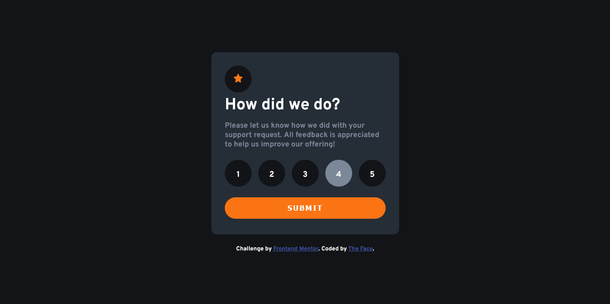

# Frontend Mentor - Interactive rating component solution

This is a solution to the [Interactive rating component challenge on Frontend Mentor](https://www.frontendmentor.io/challenges/interactive-rating-component-koxpeBUmI). Frontend Mentor challenges help you improve your coding skills by building realistic projects.

### Screenshot

### Links

- Solution URL: [Add solution URL here](https://github.com/iamtheface/Ratings)
- Live Site URL: [Add live site URL here](https://thefacerating.netlify.app)

## My process

### Built with

- Semantic HTML5 markup
- CSS custom properties
- Flexbox
- CSS Grid
- Mobile-first workflow
- JavaScript

## Author

- Website - [Ezekiel The Face](https://thefaceportfolio.netlify.app)
- Frontend Mentor - [@iamtheface](https://www.frontendmentor.io/profile/iamtheface)
- Twitter - [@thefacetweets](https://www.twitter.com/thefacetweets)
